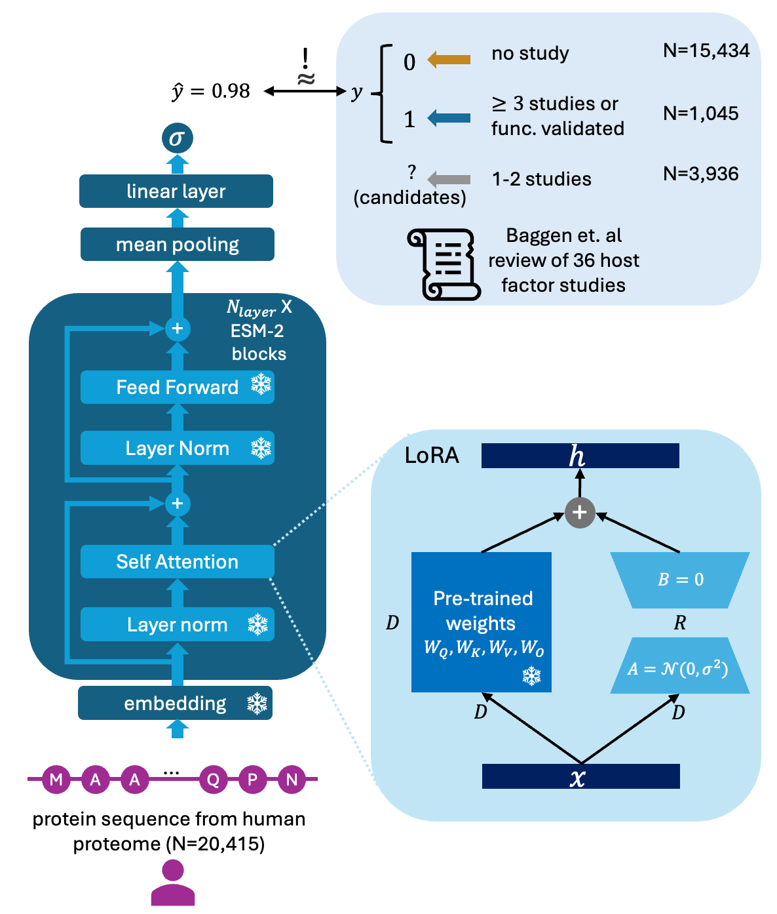

# TransFactor

## Usage
### 1. Install
```git clone https://github.com/marsico-lab/TransFactor.git```

```conda env create -f environment.yml```


### 2. Run hyperparameter optimization with Optuna
```conda activate transfactor```

```python transfactor_optuna.py```

### 3. Predict using saved models
```conda activate transfactor```

```python predict.py --ckpt_path <path_to_model_checkpoint> --out_dir <out_dir>```

## Reproduce results from manuscript
Please find the corresponding notebooks and scripts in `/manuscript`. To download the saved model checkpoints and alanine scan results, please download those here: 
https://1drv.ms/f/s!AhK2hrQjl9NtlIgf9ueMG5xV94JBUA?e=k1kHZF
